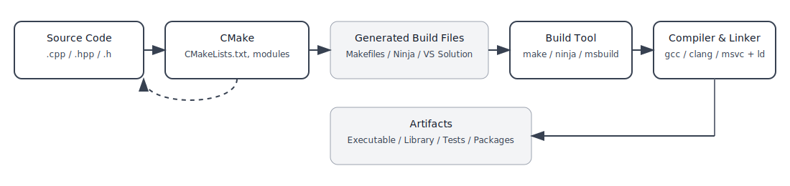

# Chapter 3: Setting Up a CMake Project

<p align="center">
  
</p>

---

## 📂 Step 1: Creating CMake Project

Let’s build our first **Hello World** project with a basic CMake project structure, introducing a separate library for better organization.

**Folder structure:**

```
MyProject/
├── CMakeLists.txt
│
├── hello/
│   ├── include/
│   │   └── hello.h
│   └── src/
│       └── hello.cpp
│
└── main.cpp
```

---

### 📝 Example Code

```cpp
// hello/include/hello.h
#pragma once
#include <string>

std::string getMessage();
```

```cpp
// hello/src/hello.cpp
#include "hello.h"

std::string getMessage()
{
  return "Hello, CMake!";
}
```

```cpp
// main.cpp
#include <iostream>
#include "hello.h"

int main()
{
  std::cout << getMessage() << std::endl;
  return 0;
}
```

---

## ⚙️ Step 2: Creating `CMakeLists.txt`

At the root `MyProject/CMakeLists.txt`:

```cmake
# MyProject/CMakeLists.txt
cmake_minimum_required(VERSION 3.10)
project(MyProject)

# Add the hello library
add_library(hello STATIC
    hello/src/hello.cpp
)

# Specify include directory for the library
target_include_directories(hello PUBLIC hello/include)

# Create main executable
add_executable(MyProject
    main.cpp
)

# Link library to the main target
target_link_libraries(MyProject PRIVATE hello)
```

📌 This tells CMake:

* Minimum required version and project name
* Build a static library `hello` from `hello.cpp`
* Expose the `hello/include` folder to anything linking with the library
* Build the `MyProject` executable from `main.cpp`
* Link the `hello` library with the `MyProject` target

---

## ⚡ Step 3: Configuring and Building

From your project root:

```bash
mkdir build && cd build
cmake ..
cmake --build .
```

<p align="center">
  
</p>

---

### 🔍 What’s Happening?

1. **`cmake ..`** → Configures the project and generates native build files (Makefile, Ninja, etc.).
2. **`cmake --build .`** → Invokes the selected build tool automatically.

📷 *Example build output*:

```
-- Configuring done
-- Generating done
-- Build files have been written to: /path/to/MyProject/build
[100%] Building CXX object hello/CMakeFiles/hello.dir/src/hello.cpp.o
[100%] Linking CXX static library libhello.a
[100%] Built target hello
[100%] Building CXX object CMakeFiles/MyProject.dir/main.cpp.o
[100%] Linking CXX executable MyProject
```

---

## ⚙️ The CMake Build Process

<p align="center">
  
</p>

---

### 🔍 Step-by-Step Flow

#### 1. **Source Code**

* Your project files: `.cpp`, `.h`, `.hpp`
* Contains the actual logic of your program.

#### 2. **CMake (`CMakeLists.txt`)**

* You write project rules in `CMakeLists.txt`.
* CMake **parses configuration** and **generates build files** for your platform.

#### 3. **Generated Build Files**

* Examples: `Makefile`, Ninja files, Visual Studio solutions, Xcode projects.
* These files are not compiled code, but **instructions for the build tool**.

#### 4. **Build Tool**

* Tools like `make`, `ninja`, or `msbuild`.
* Reads the generated build instructions and calls the appropriate **compiler and linker**.

#### 5. **Compiler & Linker**

* Compilers: `gcc`, `clang`, `msvc`.
* Tasks:

  * Compile `.cpp` → object files (`.o` / `.obj`)
  * Link object files into executables (`.exe`, `a.out`) or libraries (`.so`, `.dll`, `.a`).

#### 6. **Final Artifacts**

* What you ship or run:

  * **Executables** (your app)
  * **Static/Shared libraries**
  * **Tests & installable packages**

---

👉 **Takeaway:**

* Splitting your code into libraries makes your project modular and reusable.
* With CMake, you can easily create libraries and link them to executables.

---

✅ **Pro Tip:** Always use an **out-of-source build** (`build/` folder) to keep generated files separate from your source code.

---

> [**Next:**](Chapter_4.md) Adding libraries, subdirectories, and making your CMake project scale.
